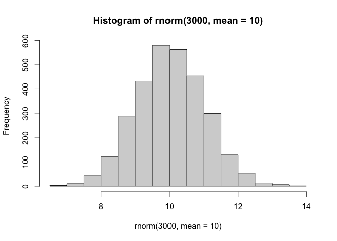
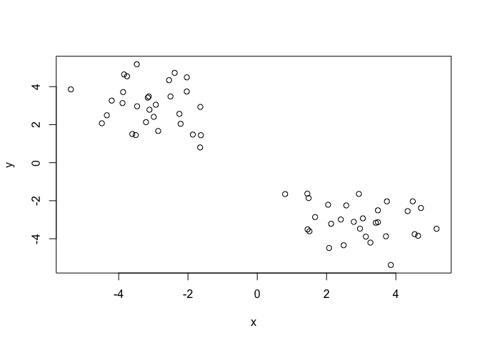
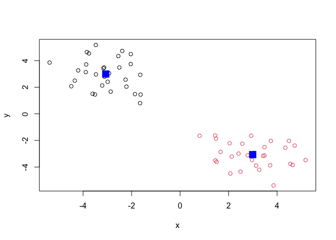
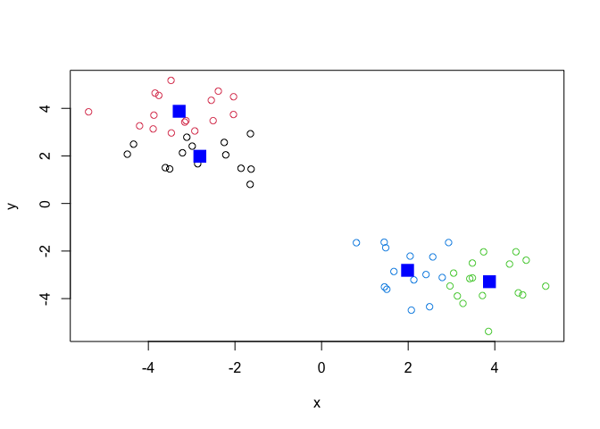
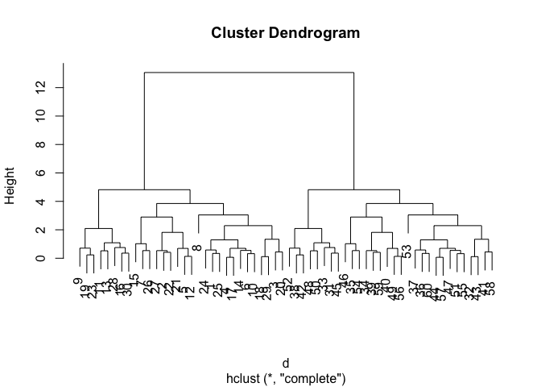
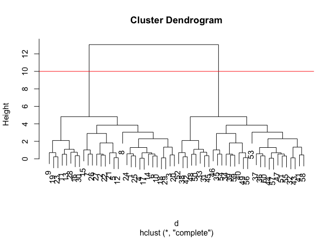
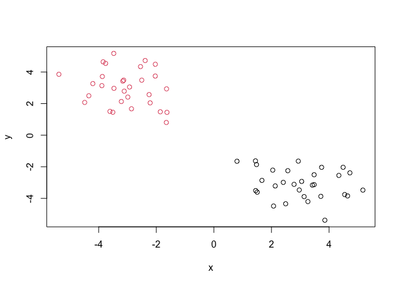
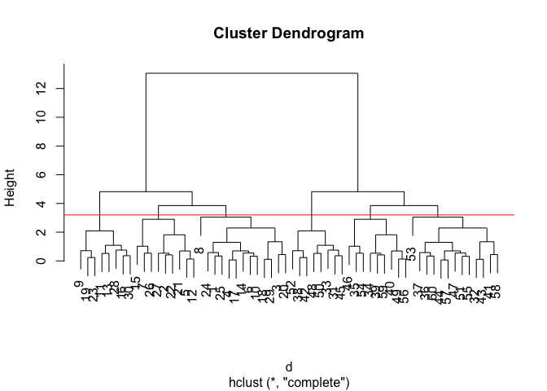
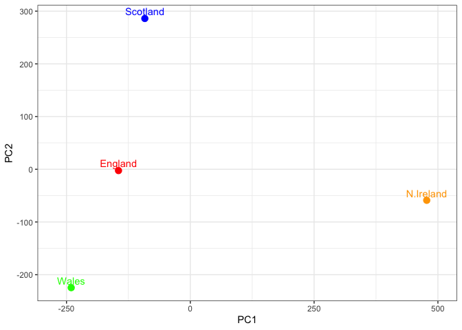

# Class 7: Machine Learning 1
Rebecca Taheri (PID A17228385)

## Background

Today we will begin out exploration of important machine learning
methods with a focus on **clustering** and **dimensionallity
reduction**.

To start testing these methods let’s make up some sample data to cluster
where we knoew what the answer should be.

``` r
hist(rnorm(3000, mean = 10))
```



> Q. Can you generate 30 numbers centered at +3 and 30 numbers ar -3
> taken from a normal ditribution?

``` r
tmp <- c(rnorm(30, mean = 3),
rnorm(30, mean = -3) )
x <- cbind(x=tmp, y=rev(tmp))

plot(x)
```



## K-means Clustering

The main function in “base R” for K-means clustering is called
`kmeans()`, let’s try it out:

``` r
k <- kmeans(x, centers = 2)
k
```

    K-means clustering with 2 clusters of sizes 30, 30

    Cluster means:
              x         y
    1 -3.065828  2.994291
    2  2.994291 -3.065828

    Clustering vector:
     [1] 2 2 2 2 2 2 2 2 2 2 2 2 2 2 2 2 2 2 2 2 2 2 2 2 2 2 2 2 2 2 1 1 1 1 1 1 1 1
    [39] 1 1 1 1 1 1 1 1 1 1 1 1 1 1 1 1 1 1 1 1 1 1

    Within cluster sum of squares by cluster:
    [1] 64.40294 64.40294
     (between_SS / total_SS =  89.5 %)

    Available components:

    [1] "cluster"      "centers"      "totss"        "withinss"     "tot.withinss"
    [6] "betweenss"    "size"         "iter"         "ifault"      

> Q. What component of your kmeans result object has the cluster
> centers?

``` r
k$centers
```

              x         y
    1 -3.065828  2.994291
    2  2.994291 -3.065828

> Q. What component of your kmeans result object has the cluster size
> (i.e. how many points are in each cluster?)

``` r
k$size
```

    [1] 30 30

> Q. What component of your kmeans result object has the cluster
> membership vector (i.e. the main clustering result: which points are
> in which cluster?)

``` r
k$cluster
```

     [1] 2 2 2 2 2 2 2 2 2 2 2 2 2 2 2 2 2 2 2 2 2 2 2 2 2 2 2 2 2 2 1 1 1 1 1 1 1 1
    [39] 1 1 1 1 1 1 1 1 1 1 1 1 1 1 1 1 1 1 1 1 1 1

> Q. Plot the results of clustering (i.e. our data colored by the
> clustering result) along with the cluster centers.

``` r
plot(x, col = k$cluster)
points(k$centers, col = "blue", pch = 15, cex = 2)
```



> Q. can you run `kmeans()` again and cluster x into 4 clusters and plot
> the results just like we did above with coloring by cluster and the
> cluster centers shown in blue?

``` r
k4 <- kmeans(x, centers = 4)
k4$centers
```

              x         y
    1 -2.811279  1.985696
    2 -3.288558  3.876811
    3  3.876811 -3.288558
    4  1.985696 -2.811279

``` r
plot(x, col = k4$cluster)
points(k4$centers, col = "blue", pch = 15, cex = 2)
```



> **Key-Point:** Kmeans will always return the clustering that we ask
> for (this is the “K” or “centers” in K-means)!

``` r
k$tot.withinss
```

    [1] 128.8059

\## Hierarchial Clustering

The main function of Hierarchical clustering in base R is called
`hclust()`. One of the main differences with respect to the `kmeans()`
function is that you can not just pass your input data directly to
`hclust()` - it needs a “distance matrix” as input. We can get this from
lot’s of places including the `dist()` function.

``` r
d <- dist(x)
hc <- hclust(d)
plot(hc)
```



We can “cut” the dendrogram or “tree” at a given height to yield our
“clusters”. For this, we use the function `cutree()`.

``` r
plot(hc)
abline(h=10, col = "red")
```



``` r
grps <- cutree(hc, h=10)
```

``` r
grps
```

     [1] 1 1 1 1 1 1 1 1 1 1 1 1 1 1 1 1 1 1 1 1 1 1 1 1 1 1 1 1 1 1 2 2 2 2 2 2 2 2
    [39] 2 2 2 2 2 2 2 2 2 2 2 2 2 2 2 2 2 2 2 2 2 2

> Q. Plot our data `x` colored by the clusterview result from `hclust()`
> and `cutree()`?

``` r
plot(x, col = grps)
```



``` r
plot(hc)
abline(h=3.2, col = "red")
```



``` r
grps <- cutree(hc, h=3.2)
```

## Principal Component Analysis (PCA)

PCA is a popular dimensionality reduction technique that is widely used
in bioinformatics.

### PCA of UK food data

Read data on food consumption in the UK

``` r
url <- "https://tinyurl.com/UK-foods"
x <- read.csv(url)
x
```

                         X England Wales Scotland N.Ireland
    1               Cheese     105   103      103        66
    2        Carcass_meat      245   227      242       267
    3          Other_meat      685   803      750       586
    4                 Fish     147   160      122        93
    5       Fats_and_oils      193   235      184       209
    6               Sugars     156   175      147       139
    7      Fresh_potatoes      720   874      566      1033
    8           Fresh_Veg      253   265      171       143
    9           Other_Veg      488   570      418       355
    10 Processed_potatoes      198   203      220       187
    11      Processed_Veg      360   365      337       334
    12        Fresh_fruit     1102  1137      957       674
    13            Cereals     1472  1582     1462      1494
    14           Beverages      57    73       53        47
    15        Soft_drinks     1374  1256     1572      1506
    16   Alcoholic_drinks      375   475      458       135
    17      Confectionery       54    64       62        41

It looks like the row names are not set properly. We can fix this

``` r
rownames(x) <- x[,1]
x <- x[,-1]
x
```

                        England Wales Scotland N.Ireland
    Cheese                  105   103      103        66
    Carcass_meat            245   227      242       267
    Other_meat              685   803      750       586
    Fish                    147   160      122        93
    Fats_and_oils           193   235      184       209
    Sugars                  156   175      147       139
    Fresh_potatoes          720   874      566      1033
    Fresh_Veg               253   265      171       143
    Other_Veg               488   570      418       355
    Processed_potatoes      198   203      220       187
    Processed_Veg           360   365      337       334
    Fresh_fruit            1102  1137      957       674
    Cereals                1472  1582     1462      1494
    Beverages                57    73       53        47
    Soft_drinks            1374  1256     1572      1506
    Alcoholic_drinks        375   475      458       135
    Confectionery            54    64       62        41

A better way to do this is fix the row names assignment at import time:

``` r
read.csv(url, row.names = 1)
```

                        England Wales Scotland N.Ireland
    Cheese                  105   103      103        66
    Carcass_meat            245   227      242       267
    Other_meat              685   803      750       586
    Fish                    147   160      122        93
    Fats_and_oils           193   235      184       209
    Sugars                  156   175      147       139
    Fresh_potatoes          720   874      566      1033
    Fresh_Veg               253   265      171       143
    Other_Veg               488   570      418       355
    Processed_potatoes      198   203      220       187
    Processed_Veg           360   365      337       334
    Fresh_fruit            1102  1137      957       674
    Cereals                1472  1582     1462      1494
    Beverages                57    73       53        47
    Soft_drinks            1374  1256     1572      1506
    Alcoholic_drinks        375   475      458       135
    Confectionery            54    64       62        41

> Q1. How many rows and columns are in your new data frame named x? What
> R functions could you use to answer this questions?

``` r
ncol(x)
```

    [1] 4

``` r
nrow(x)
```

    [1] 17

``` r
dim(x)
```

    [1] 17  4

> Q2. Which approach to solving the ‘row-names problem’ mentioned above
> do you prefer and why? Is one approach more robust than another under
> certain circumstances?

I think the second one is better because it is easier and faster.

``` r
barplot(as.matrix(x), beside=T, col=rainbow(nrow(x)))
```


> Q3. Changing what optional argument in the above barplot() function
> results in the following plot

``` r
barplot(as.matrix(x), beside=F, col=rainbow(nrow(x)))
```


If we change the argument `beside` from `T` to `F` it would make a plot
where the bars are stacked on top of each other.

``` r
library(tidyr)
# Convert data to long format for ggplot with `pivot_longer()`
x_long <- x |>
tibble::rownames_to_column("Food") |>
pivot_longer(cols = -Food,
names_to = "Country",
values_to = "Consumption")
dim(x_long)
```

    [1] 68  3

``` r
# Create grouped bar plot
library(ggplot2)
ggplot(x_long) +
aes(x = Country, y = Consumption, fill = Food) +
geom_col(position = "dodge") +
theme_bw()
```


``` r
library(ggplot2)
ggplot(x_long) +
aes(x = Country, y = Consumption, fill = Food) +
geom_col(position = "stack") +
theme_bw()
```


> Q5. We can use the `pairs()` function to generate all pairwise plots
> for our countries. Can you make sense of the following code and
> resulting figure? What does it mean if a given point lies on the
> diagonal for a given plot?

``` r
pairs(x, col=rainbow(nrow(x)), pch=16)
```


The `pairs()` function plots every variable against every other
variable. When a point is on the diagonal that means that variable is
being compared to itself.

## Heatmap

We can install the **pheatmap package** with the `install.packages()`
command that we used previously. Remember that we always run this in the
console and not a code chunk in our quarto document.

``` r
library(pheatmap)
pheatmap( as.matrix(x) )
```


Of all these plots, really only the `pairs()` plot was useful. This
however took a bit of work to interpret and will at scale when I am
looking at much bigger datasets.

> Q6. Based on the pairs and heatmap figures, which countries cluster
> together and what does this suggest about their food consumption
> patterns? Can you easily tell what the main differences between N.
> Ireland and the other countries of the UK in terms of this data-set?

England, Wales, and Scotland cluster together, indicating similar food
consumption patterns. Northern Ireland stands out in both plots,
suggesting its food consumption differs from the rest of the UK.

> Q7. Complete the code below to generate a plot of PC1 vs PC2. The
> second line adds text labels over the data points.

``` r
pca <- prcomp( t(x) )
summary(pca)
```

    Importance of components:
                                PC1      PC2      PC3     PC4
    Standard deviation     324.1502 212.7478 73.87622 2.7e-14
    Proportion of Variance   0.6744   0.2905  0.03503 0.0e+00
    Cumulative Proportion    0.6744   0.9650  1.00000 1.0e+00

``` r
# Create a data frame for plotting
df <- as.data.frame(pca$x)
df$Country <- rownames(df)
# Plot PC1 vs PC2 with ggplot
ggplot(pca$x) +
aes(x = PC1, y = PC2, label = rownames(pca$x)) +
geom_point(size = 3) +
geom_text(vjust = -0.5) +
xlim(-270, 500) +
xlab("PC1") +
ylab("PC2") +
theme_bw()
```


> Q8. Customize your plot so that the colors of the country names match
> the colors in our UK and Ireland map and table at start of this
> document

``` r
country_cols <- c( "England" = "red", "Wales" = "green", "Scotland" = "blue", "N.Ireland" = "orange")
ggplot(pca$x) + 
  aes(x = PC1, y = PC2, label = rownames(pca$x), color = rownames(pca$x)) + geom_point(size = 3) +
geom_text(vjust = -0.5) + scale_color_manual(values = country_cols) + 
xlim(-270, 500) +
xlab("PC1") +
ylab("PC2") +
theme_bw() + theme(legend.position = "none")
```



> Q9: Generate a similar ‘loadings plot’ for PC2. What two food groups
> feature prominantely and what does PC2 maninly tell us about?

``` r
ggplot(pca$rotation) +
aes(x = PC2,
y = reorder(rownames(pca$rotation), PC2)) +
geom_col(fill = "steelblue") +
xlab("PC2 Loading Score") +
ylab("") +
theme_bw() +
theme(axis.text.y = element_text(size = 9))
```


The two that stand out the most for PC2 are soft drinks and fresh
potatoes, PC2 shows the differences in how much these food are consumed
aross countries.

> Q10: How many genes and samples are in this data set? How many PCs do
> you think it will take to have a useful overview of this data set (see
> below)?

``` r
url2 <- "https://tinyurl.com/expression-CSV"
rna.data <- read.csv(url2, row.names=1)
head(rna.data)
```

           wt1 wt2  wt3  wt4 wt5 ko1 ko2 ko3 ko4 ko5
    gene1  439 458  408  429 420  90  88  86  90  93
    gene2  219 200  204  210 187 427 423 434 433 426
    gene3 1006 989 1030 1017 973 252 237 238 226 210
    gene4  783 792  829  856 760 849 856 835 885 894
    gene5  181 249  204  244 225 277 305 272 270 279
    gene6  460 502  491  491 493 612 594 577 618 638

There are 6 genes and 10 samples in this dataset. I think it will take
around 3 PCs to have a useful overview of this data set.

## PCA The Rescue

``` r
pca <- prcomp(t(x))
summary(pca)
```

    Importance of components:
                                PC1      PC2      PC3     PC4
    Standard deviation     324.1502 212.7478 73.87622 2.7e-14
    Proportion of Variance   0.6744   0.2905  0.03503 0.0e+00
    Cumulative Proportion    0.6744   0.9650  1.00000 1.0e+00

> Q. How much variance is captured in the first PC?

67.4%

> Q. How many PCs do I need to capture at least 90% of the total
> variance in the dataset?

2 PCs capture 96.5% of the total variance

> Q. Plot our main PCA result. Folks like to call this different things
> depending on their field of study e.g. “PC plot”, “ordienation plot”,
> “Score plot”, “PC1 vs. PC2 plot”…

``` r
attributes(pca)
```

    $names
    [1] "sdev"     "rotation" "center"   "scale"    "x"       

    $class
    [1] "prcomp"

``` r
pca$x
```

                     PC1         PC2        PC3           PC4
    England   -144.99315   -2.532999 105.768945  1.612425e-14
    Wales     -240.52915 -224.646925 -56.475555  4.751043e-13
    Scotland   -91.86934  286.081786 -44.415495 -6.044349e-13
    N.Ireland  477.39164  -58.901862  -4.877895  1.145386e-13

``` r
my_cols <- c("orange", "red", "blue", "darkgreen")
plot(pca$x[,1], pca$x[,2], col = my_cols, pch=16) 
```


``` r
library(ggplot2)
ggplot(pca$x) +
aes(PC1, PC2) +
geom_point(col = my_cols)
```


